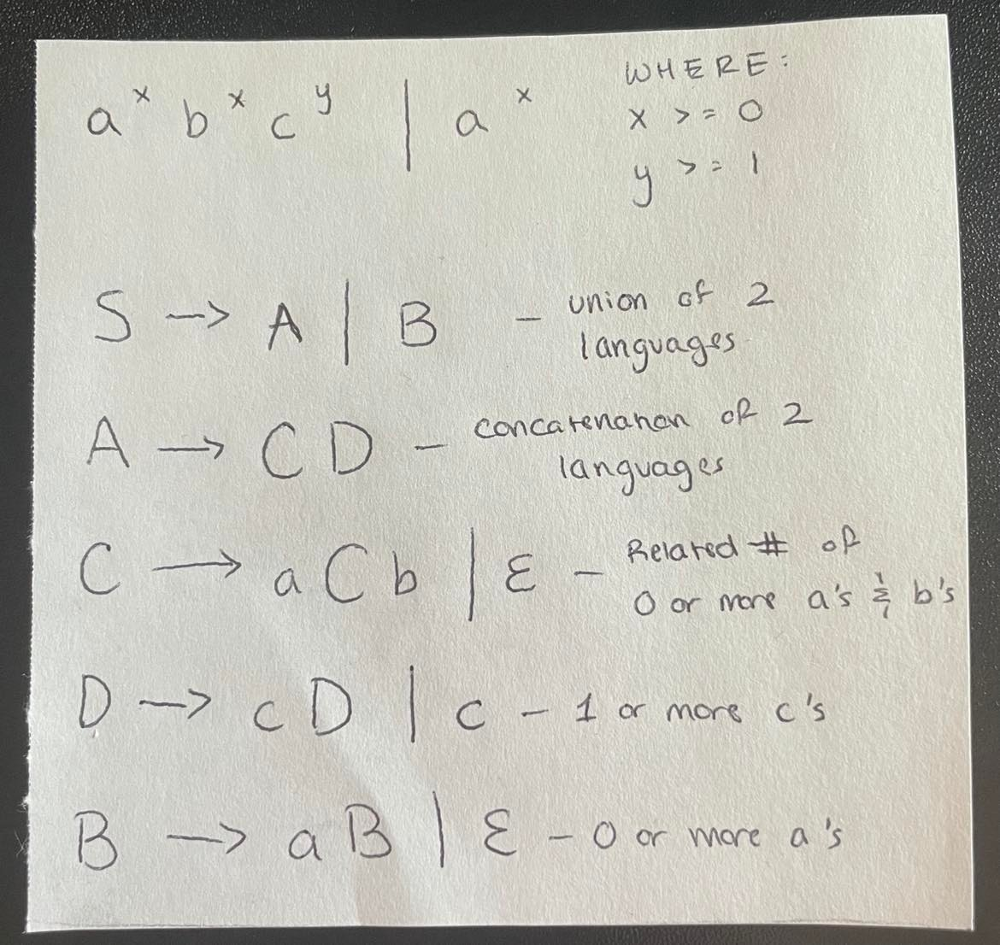

# Discussion 8 - Friday, October 28th
## Reminders
### Project 3 due November 3th, 11:59. ***please start early***
### NFA/DFA Quiz today (20 mins)

## Parsing and Grammars, Explanation
### 1) Terminals, non-terminals and productions
### 2) Practice designing grammars

### 3) Practice derivations
Grammar: S -> S + S | 1 | 2 | 3

Leftmost derivation of 1 + 2 + 3
* Start w/ S and use the production rules on the LEFTMOST nonterminal ONE AT A TIME. (For a rightmost derivation, use the productions on the RIGHTMOST nonterminal.)
* ONE NONTERMINAL AT A TIME!!!! DON'T COMBINE STEPS!!!!
* S -> S + S -> S + S + S -> 1 + S + S -> 1 + 2 + S -> 1 + 2 + 3
* S -> S + S -> 1 + S -> 1 + S + S -> 1 + 2 + S -> 1 + 2 + 3 works too

Note: If there are 2 derivations for the same string, what does that mean? The grammar is ambiguous.
  * To show that a grammar is ambiguous, show 2 different derivations for the same string.
  * It's hard to know whether a grammar is ambiguous or not (it's an undecidable problem afaik). But be suspicious if you see something along the lines of S -> SS, S -> SSS, S -> S+S, etc.